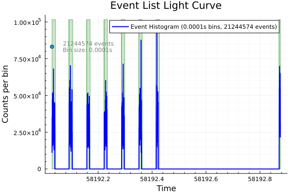
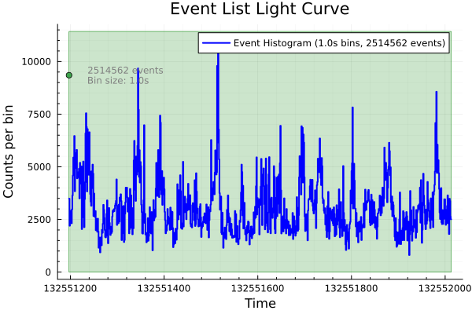

## EventList
The main container for X-ray event data.

```julia
# Basic structure
struct EventList{TimeType, MetaType}
    times::TimeType          # Event arrival times
    energies::Union{Nothing, TimeType}  # Event energies (optional)
    meta::MetaType          # FITS metadata
end
```

### FITSMetadata
Contains all file metadata including timing corrections and GTI information.

## 1. PRIMARY READING FUNCTION

### `readevents()` - The Main Entry Point

**Purpose**: Read X-ray event data from FITS files with automatic timing corrections.

#### Basic Usage Examples:
I am using nicer data from [here](https://heasarc.gsfc.nasa.gov/FTP/nicer/data/obs/2018_03/1200120104/xti/event_cl/) {heasarc datas}
So basically, you will find two files:)

[] .ufa Files are unfiltered, calibrated NICER event files containing all raw events, including bad or non-X-ray events, mainly for initial analysis.

[] .cl Files are clean, calibrated event files that have been screened to remove bad or non-X-ray events, ready for scientific analysis.

For more detailed information on NICER data processing and file formats, you can refer to the official HEASARC documentation: [HEASARC](https://heasarc.gsfc.nasa.gov/docs/software/lheasoft/help/nicerl3-spect.html).

## Function Signature

```julia
function readevents(
    path::AbstractString;
    mission::Union{String,Nothing} = nothing,
    instrument::Union{String,Nothing} = nothing,
    epoch::Union{Float64,Nothing} = nothing,
    hdu::Int = 2,
    T::Type = Float64,
    sort::Bool = false,
    extra_columns::Vector{String} = String[],
    energy_alternatives::Vector{String} = ["ENERGY", "PI", "PHA"],
    load_gti::Bool = true,
    gti_hdu_candidates::Vector{String} = ["GTI", "STDGTI"],
    gti_hdu_indices::Union{Vector{Int},Nothing} = nothing,
    combine_gtis::Bool = true,
    apply_gti_filter::Bool = false,
    convert_to_mjd::Bool = false,
    kwargs...
) -> EventList
```

## Key Parameters

### Basic Parameters
- `path`: FITS file path
- `hdu`: HDU index containing event data (default: 2)
- `T`: Data type for arrays (default: Float64)
- `sort`: Sort events by time if not already sorted

### Mission-Specific Parameters
- `mission`: Mission name for automatic calibration and timing
- `instrument`: Instrument identifier (e.g., "FPM_A" for NuSTAR)
- `epoch`: Observation epoch in MJD for time-dependent calibrations

### Energy Handling
- `energy_alternatives`: Column names to search for energy data
- Mission-specific defaults override this parameter

### GTI Parameters
- `load_gti`: Load Good Time Interval information
- `apply_gti_filter`: Filter events using GTI (can remove all events!)
- `gti_hdu_candidates`: HDU names to search for GTI data
- `gti_hdu_indices`: Specific HDU indices to check for GTI
- `combine_gtis`: Merge multiple GTI sources

### Time Conversion
- `convert_to_mjd`: Convert times to Modified Julian Date format

## Mission-Specific Details

### Supported Missions

| Mission | Aliases | Calibration | Energy Units | Special Features |
|---------|---------|-------------|--------------|------------------|
| NuSTAR  | "nustar" | PI → keV: `pi * 0.04 + 1.62` | PI channels | Dual telescopes (FPM_A/B) |
| XMM-Newton | "xmm" | PI → keV: `pi * 0.001` | PI channels | Multiple detectors, GTI0 extension |
| NICER   | "nicer" | PI → keV: `pi * 0.01` | PI channels | Neutron star timing |
| IXPE    | "ixpe" | PI → keV: `pi / 375 * 15` | PI channels | X-ray polarimetry |
| Chandra | "chandra", "axaf" | PI → keV: `(pi - 1) * 14.6e-3` | PI channels | High spatial resolution |
| RXTE    | "xte" | PI → keV: `pi * 0.025` | PHA channels | Legacy mission |


# readevents() Parameter Analysis

## Core Function Signature
```julia
readevents(path; mission, instrument, epoch, hdu, T, sort, extra_columns, 
          energy_alternatives, load_gti, gti_hdu_candidates, gti_hdu_indices, 
          combine_gtis, apply_gti_filter, convert_to_mjd, kwargs...)
```


```julia
eventfile = "ni1200120104_0mpu7_cl.evt"
events = readevents(eventfile,
    hdu=2,
    sort=true,
    load_gti=true,
    apply_gti_filter=true,
    convert_to_mjd=true,
    extra_columns=["RAWX", "RAWY"]
)
```


    EventList with 21244574 times and energies
    


Precaution: When using `convert_to_mjd=true` with `apply_gti_filter=true`, bin sizes must be scaled by `1/86400` to maintain equivalent temporal resolution
`(1.0 second becomes 1.0/86400 days)`.

```julia
using Plots #whenever plotting start via using plot
plot(events, 0.0001, show_gti=true)
```



## Critical Parameters

### `hdu::Int = 2`
**Purpose**: Specifies which HDU (Header Data Unit) to read from FITS file
- Default HDU 2 typically contains event data
- HDU 1 usually contains primary header only
- Effects: Wrong HDU reads incorrect data or fails entirely

### `sort::Bool = false`  
**Purpose**: Controls time ordering of events
- `false`: Events remain in file order (faster loading)
- `true`: Events sorted by TIME column (required for most analyses)
- Effects: Unsorted data breaks time-based operations, histograms, GTI filtering

### `T::Type = Float64`
**Purpose**: Data type for time and energy arrays
- Controls precision and memory usage
- `Float32`: Half memory, reduced precision
- `Float64`: Full precision, double memory
- Effects: Precision loss may affect timing analysis accuracy

### `extra_columns::Vector{String} = String[]`
**Purpose**: Additional FITS columns to read beyond TIME and energy
- Examples: `["RAWX", "RAWY", "DET_ID", "GRADE"]`
- Effects: Only specified columns available for analysis

### `energy_alternatives::Vector{String}`  
**Purpose**: Column names to search for energy information
- Default: `["ENERGY", "PI", "PHA"]` 
- Priority order: first found column used
- Effects: Wrong energy column affects spectral analysis

## GTI (Good Time Interval) Parameters

### `load_gti::Bool = true`
**Purpose**: Whether to read GTI information from file
- `true`: Loads GTI data for filtering/visualization
- `false`: No GTI information available
- Effects: Cannot filter bad time periods or show GTI regions

### `gti_hdu_candidates::Vector{String} = ["GTI", "STDGTI"]`
**Purpose**: HDU names to search for GTI data
- Mission-specific GTI extensions have different names
- Effects: Wrong candidates prevent GTI loading

### `combine_gtis::Bool = true` 
**Purpose**: How to handle multiple GTI intervals
- `true`: Merges overlapping intervals
- `false`: Keeps separate intervals
- Effects: Affects interval counting and filtering logic

### `apply_gti_filter::Bool = false`
**Purpose**: Whether to remove events outside GTI intervals
- **Most critical parameter for data volume**
- `false`: Keep all events (show GTI as overlay)
- `true`: Delete events outside good time intervals
- Effects: Can remove 80-90% of data

## Time System Parameters

### `convert_to_mjd::Bool = false`
**Purpose**: Time coordinate system conversion  
- `false`: Mission time in seconds from epoch
- `true`: Modified Julian Date in days
- **Critical for bin size interpretation**
- Effects: Changes time units, affects all time-based calculations

### Mission-Specific Time Keywords
Extracted from FITS header:
- `MJDREF`: Reference MJD for time conversion
- `TIMEZERO`: Time offset correction  
- `TIMEUNIT`: Time unit scaling factor
- `TIMEDEL`: Time bin width for binned data
- `TIMEPIXR`: Bin center correction factor

## Parameter Interactions

### Critical Combinations

#### 1. GTI Filtering Impact
```julia
# Scenario A: Show all data with GTI overlay
readevents(file, load_gti=true, apply_gti_filter=false)
# Result: Full dataset, GTI shown as regions

# Scenario B: Clean data only  
readevents(file, load_gti=true, apply_gti_filter=true)
# Result: Reduced dataset, higher count rates in remaining periods
```

#### 2. Time System & Bin Size
```julia  
# Mission time (seconds)
events = readevents(file, convert_to_mjd=false)
plot(events, 1.0)  # 1.0 = 1 second bins

# MJD time (days)
events = readevents(file, convert_to_mjd=true)  
plot(events, 1.0)  # 1.0 = 1 DAY bins (86,400 seconds!)
plot(events, 1.0/86400)  # Equivalent 1 second bins
```

#### 3. Precision vs Performance
```julia
# High precision, more memory
readevents(file, T=Float64, extra_columns=["RAWX", "RAWY", "DET_ID"])

# Lower precision, less memory  
readevents(file, T=Float32, extra_columns=[])
```

## Common Issues

### Data Volume Mismatches
- GTI filtering can remove majority of observation time
- Remaining events concentrated in short intervals
- Creates high count rate periods vs empty regions

### Time Unit Confusion
- Bin sizes must match time coordinate system
- MJD requires day-scale bin sizes for second-scale features
- Mission time uses second-scale bins directly

### Missing Dependencies
- Energy analysis requires successful energy column identification
- Spatial analysis needs detector coordinate columns
- Time analysis requires sorted events

### Memory Constraints
- Large files with extra columns consume significant memory
- Float64 precision doubles memory usage vs Float32
- Consider data subsets for exploration

## Best Practices

### For Exploration
```julia
readevents(file, sort=true, load_gti=true, apply_gti_filter=false)
```

### For Scientific Analysis  
```julia
readevents(file, sort=true, load_gti=true, apply_gti_filter=true, 
          extra_columns=["DET_ID"], T=Float64)
```

### For Performance
```julia  
readevents(file, sort=true, load_gti=false, T=Float32)
```

Each parameter fundamentally alters the resulting dataset structure, time coordinates, and available analysis capabilities.

### Mission-Specific Behaviors

#### NuSTAR
```julia
# Basic NuSTAR reading
nustar_a = readevents("nu12345_A.fits", mission="nustar", instrument="FPM_A")
nustar_b = readevents("nu12345_B.fits", mission="nustar", instrument="FPM_B")

# Energy alternatives: ["PI", "ENERGY", "PHA"]
# GTI extensions: ["GTI", "STDGTI"]
```

#### XMM-Newton


```julia
# XMM reading with automatic GTI0 search
xmm = readevents("xmm_test.fits",mission="xmm",short=true)

# Mission patches add "GTI0" to GTI search
# Energy alternatives: ["ENERGY", "PI", "PHA"]
# GTI extensions: ["GTI", "GTI0", "STDGTI"]
```


    EventList with 1708244 times and energies
    


```julia
plot(xmm,1.0,show_gti=true)
```


#### NICER


```julia
# NICER with typical settings
nicer = readevents("ni1200120104_0mpu7_cl.evt", 
                  mission="nicer",
                  sort=true,
                  load_gti=true)

# Energy alternatives: ["ENERGY", "PI", "PHA"]
# Automatic PI to keV conversion
```


    EventList with 21244574 times and energies
    


```julia
plot(nicer,1.0,show_gti=true)
```


#### Chandra/AXAF


```julia
# Chandra reading
chandra = readevents("chandra_test.fits", mission="chandra",sort=true)

# Mission patches map:
# DETNAM → detector
# TIMESYS → time_system
# Energy alternatives: ["ENERGY", "PI", "PHA"]
# GTI extensions: ["GTI", "GTI0", "GTI1", "GTI2", "GTI3"]
```


    EventList with 4612 times and energies
    


```julia
plot(chandra,1.0,show_gti=true)
```


#### RXTE/XTE

#### we are using this [rxte docs](https://heasarc.gsfc.nasa.gov/docs/xte/abc/time_tutorial.html) in stingray.jl for MJD,TIMEDEL and many other reference 


```julia
# XTE reading with epoch for time-dependent calibration
xte = readevents("xte_gx_test.evt.gz", 
                mission="xte",
                instrument="PCA",short = true)  # MJD epoch

# Mission patches set:
# ecol → "PHA"
# ccol → "PCUID"
# Energy alternatives: ["PHA", "PI", "ENERGY"]
```


    EventList with 3518 times and energies
    


```julia
using Plots
plot(xte,1.0,show_gti=true)
```


## Time System and MJD Conversion

### X-ray Astronomy Time Standards

#### Raw Mission Times
- **Mission Elapsed Time (MET)**: Seconds since mission epoch
- **Spacecraft Time**: Raw detector timestamps
- **Observatory-specific**: Each mission has its own time system

#### Timing Keywords in FITS Headers
- **MJDREF/MJDREFI+MJDREFF**: Mission reference epoch in MJD
- **TIMEZERO**: Clock correction offset (seconds)
- **TIMEUNIT**: Time unit conversion factor 
- **TIMESYS**: Time system ("TT", "UTC", "TAI", etc.)
- **TIMEPIXR**: Time pixel reference (0.0 = start of bin, 0.5 = center)
- **TIMEDEL**: Time bin size (for binned data)

### Time Conversion Process


```julia
# The conversion happens in this order:
# 1. Read raw TIME column (mission elapsed seconds)
raw_time = fits_time_column

# 2. Apply timing corrections
effective_timezero = isnothing(time_zero) ? 0.0 : time_zero
corrected_time = raw_time .+ effective_timezero

# 3. Apply bin-centering correction (if TIMEDEL > 0)
if !isnothing(time_del) && time_del > 0.0
    effective_timepixr = isnothing(time_pixr) ? 0.0 : time_pixr
    bin_center_correction = (0.5 - effective_timepixr) * time_del
    corrected_time .= corrected_time .+ bin_center_correction
end

# 4. Convert to MJD if requested
if convert_to_mjd && !isnothing(mjd_ref)
    mjd_time = sec_to_mjd(corrected_time, mjd_ref)
    # MJD = MJDREF + (TIME + TIMEZERO)/86400.0
end
```

### MJD Conversion Examples


```julia
# Keep times in seconds (default)
events_sec = readevents("xte_gx_test.evt.gz", convert_to_mjd=false)
println("Time range (seconds): ", extrema(times(events_sec)))
# Convert to MJD
events_mjd = readevents("xte_gx_test.evt.gz", convert_to_mjd=true)
println("Time range (MJD): ", extrema(times(events_mjd)))

# Manual conversion
mjd_times = sec_to_mjd(times(events_sec), events_sec.meta.mjd_ref)
```

    Time range (seconds): (5.0379784497045517e8, 5.037979466809172e8)
    Time range (MJD): (55183.994272621014, 55183.99544982543)
    


    3518-element Vector{Float64}:
     55183.994272621014
     55183.99427262147
     55183.994272621705
     55183.994272621814
     55183.994272622745
     55183.994272622855
     55183.994272626
     55183.99427262611
     55183.99427262644
     55183.994272627
     55183.99427262711
     55183.994272627235
     55183.994272627446
         ⋮
     55183.99544679257
     55183.99544772806
     55183.99544780467
     55183.995447890935
     55183.99544804832
     55183.9954482536
     55183.99544839902
     55183.99544882986
     55183.995448908885
     55183.995449136935
     55183.995449289454
     55183.99544982543


### When to Use MJD Conversion

#### Use MJD (`convert_to_mjd=true`) when:
- Comparing observations from different missions
- Coordinating with optical/radio observations
- Working with absolute time references
- Publishing results with standard astronomical times

#### Keep seconds (`convert_to_mjd=false`) when:
- Doing timing analysis (power spectra, cross-correlation)
- Working with single observations
- Maximizing numerical precision for short observations
- Interfacing with timing analysis software (Stingray, XRONOS)

## GTI (Good Time Interval) Handling

### What are GTIs?
GTIs define time intervals when the detector was collecting reliable data:
- Exclude spacecraft slews
- Remove high-background periods
- Filter out calibration times
- Mark detector operational status

### GTI Data Structure
```julia
# GTI matrix: N×2 array
gti_matrix = [
    start_time_1  stop_time_1;
    start_time_2  stop_time_2;
    ...
]
```

### GTI Loading Process

```julia
# 1. Search strategy (in order):
#    a. Check gti_hdu_candidates: ["GTI", "STDGTI"]
#    b. Check gti_hdu_indices if specified
#    c. Auto-detect HDUs with START/STOP columns

# 2. Combine multiple GTI sources if combine_gtis=true
# 3. Sort intervals by start time
# 4. Merge overlapping intervals
```

### GTI Examples


```julia
# Load GTI without filtering
events = readevents("ni1200120104_0mpu7_cl.evt", load_gti=true, apply_gti_filter=false)

if has_gti(events)
    println("GTI loaded: $(size(gti(events), 1)) intervals")
    println("Total exposure: $(gti_exposure(events)) seconds")
    gti_info(events)
end
```

    GTI loaded: 16 intervals
    Total exposure: 8285.455264389515 seconds
    


```julia
# Apply GTI filtering 
filtered_events = readevents("ni1200120104_0mpu7_cl.evt", 
                           load_gti=true, 
                           apply_gti_filter=true)
if has_gti(events)
    println("GTI loaded: $(size(gti(filtered_events), 1)) intervals")
    println("Total exposure: $(gti_exposure(filtered_events)) seconds")
    gti_info(events)
end
```

    GTI loaded: 16 intervals
    Total exposure: 8285.455264389515 seconds
    


```julia
# Custom GTI sources
custom_gti = readevents("ni1200120104_0mpu7_cl.evt",
                       gti_hdu_candidates=["MYGTI", "GOODTIME"],
                       gti_hdu_indices=[5, 6, 7])
if has_gti(events)
    println("GTI loaded: $(size(gti(custom_gti), 1)) intervals")
    println("Total exposure: $(gti_exposure(custom_gti)) seconds")
    gti_info(events)
end
```

    GTI loaded: 16 intervals
    Total exposure: 8281.37797601521 seconds
    

## Energy Calibration

### Energy Column Priority
Each mission has preferred energy column names:

```julia
# Mission-specific energy alternatives:
nustar:  ["PI", "ENERGY", "PHA"]
chandra: ["ENERGY", "PI", "PHA"] 
xte:     ["PHA", "PI", "ENERGY"]
default: ["ENERGY", "PI", "PHA"]
```

### Automatic Calibration Process

```julia
# 1. Find energy column using mission-specific alternatives
# 2. If PI column found and mission specified:
#    - Apply mission calibration function
#    - Convert PI channels to keV
#    - Update energy_units metadata to "ENERGY"
# 3. If ENERGY column found:
#    - Use directly (assumed already in keV)
# 4. If PHA column found:
#    - Use directly (mission-specific units)
```

### Manual Calibration


```julia
# Get mission support for manual calibration
ms = get_mission_support("nustar")
pi_channels = [100, 500, 1000, 1500]
energies_kev = apply_calibration(ms, pi_channels)
println("NuSTAR PI→keV: $pi_channels → $energies_kev")
```

    NuSTAR PI→keV: [100, 500, 1000, 1500] → [5.62, 21.62, 41.62, 61.62]
    


```julia
# Available calibration functions
for (mission, func) in SIMPLE_CALIBRATION_FUNCS
    sample_energy = func(1000)  # PI=1000
    println("$mission: PI 1000 → $sample_energy keV")
end
```

    axaf: PI 1000 → 14.5854 keV
    chandra: PI 1000 → 14.5854 keV
    nustar: PI 1000 → 41.62 keV
    xmm: PI 1000 → 1.0 keV
    xte: PI 1000 → 25.0 keV
    nicer: PI 1000 → 10.0 keV
    ixpe: PI 1000 → 40.0 keV
    

## Advanced Usage Examples

### Multi-Mission Comparison


```julia
# Read data from different missions with consistent timing
missions = [
    ("NICER", "ni1200120104_0mpu7_cl.evt", "nicer"),
    #("NuSTAR", "__", "nustar"), 
    ("XMM", "xmm_test.fits", "xmm"),
    ("Chandra","chandra_test.fits", "chandra"),
    ("xte","xte_gx_test.evt.gz","xte")
]
# 1.62+pi*0.42 
events_dict = Dict()
for (name, file, mission) in missions
    events_dict[name] = readevents(file,
        mission=mission,
        convert_to_mjd=true,  # Common time reference
        sort=true,
        load_gti=true
    )
    
    if has_energies(events_dict[name])
        e_range = extrema(energies(events_dict[name]))
        println("$name: $(length(events_dict[name])) events, $e_range keV")
    end
end
```

    NICER: 21244574 events, (0.2, 15.0) keV
    XMM: 1708244 events, (0.0, 0.341) keV
    Chandra: 4612 events, (167.05715942382812, 17944.037109375) keV
    xte: 3518 events, (2.0, 255.0) keV
    

### Time-Dependent Analysis


```julia
# For missions with time-dependent calibration
old_xte = readevents("xte_gx_test.evt.gz",
    mission="xte",
    epoch=49000.0,  # Early mission epoch
    convert_to_mjd=true
)

recent_xte = readevents("xte_gx_test.evt.gz", 
    mission="xte",
    epoch=52000.0,  # Later mission epoch
    convert_to_mjd=true
)
```


    EventList with 3518 times and energies
    


```julia
plot(old_xte,1.0,show_gti=true)
```


```julia
plot(recent_xte,1.0,show_gti=true)
```


### Custom Column Reading


```julia
# Read additional instrument-specific columns
detailed_events = readevents("chandra_test.fits",
    mission="chandra",
    extra_columns=["ENERGY", "PI", "PHA", "GRADE", "STATUS", 
                  "CHIPX", "CHIPY", "TDETX", "TDETY"],
    load_gti=true,
    sort=true
)

# Access extra columns
if haskey(detailed_events.meta.extra_columns, "GRADE")
    grades = detailed_events.meta.extra_columns["GRADE"]
    println("Grade distribution: ", countmap(grades))
end
```

    ┌ Warning: Column 'STATUS' not found in FITS file
    └ @ Main C:\Users\asus4\Desktop\docs\notebook_stingray_julia\events.jl:1134
    ┌ Warning: Column 'CHIPX' not found in FITS file
    └ @ Main C:\Users\asus4\Desktop\docs\notebook_stingray_julia\events.jl:1134
    ┌ Warning: Column 'CHIPY' not found in FITS file
    └ @ Main C:\Users\asus4\Desktop\docs\notebook_stingray_julia\events.jl:1134
    ┌ Warning: Column 'TDETX' not found in FITS file
    └ @ Main C:\Users\asus4\Desktop\docs\notebook_stingray_julia\events.jl:1134
    ┌ Warning: Column 'TDETY' not found in FITS file
    └ @ Main C:\Users\asus4\Desktop\docs\notebook_stingray_julia\events.jl:1134
    

    Grade distribution: Dict{Int16, Int64}(0 => 1153, 4 => 552, 6 => 1296, 2 => 1055, 3 => 556)
    

### basic bar plot for comparison


```julia
using Plots, StatsBase
grades = detailed_events.meta.extra_columns["GRADE"]
grade_counts = countmap(grades)
# Extract sorted keys and values
keys_sorted = sort(collect(keys(grade_counts)))
values_sorted = [grade_counts[k] for k in keys_sorted]
bar(keys_sorted, values_sorted,
    xlabel="Grade",
    ylabel="Count",
    title="Grade Distribution (Chandra)",
    legend=false,
    color=:purple
)
```


## Performance Considerations

### Memory Efficiency
- Use `apply_gti_filter=true` to reduce memory usage
- Specify `T=Float32` for large files to halve memory usage
- Avoid reading unnecessary `extra_columns`

### I/O Efficiency
- Set `load_gti=false` if GTI not needed
- Use `sort=false` if data is already sorted
- Specify exact `hdu` to avoid searching

### Type Stability
```julia
# Good: Type-stable calls
events = readevents(filepath, mission="nicer", sort=true)

# Avoid: Dynamic mission strings
mission_var = get_mission_from_user()  # Could be anything
events = readevents(filepath, mission=mission_var)  # Less efficient
```

## Common Issues and Solutions

### 1. "No events remain after filtering"
```julia
# Problem: GTI filtering removes all events
# Solution: Check GTI overlap first
events = readevents("data.fits", load_gti=true, apply_gti_filter=false)
if has_gti(events)
    gti_range = extrema(gti(events))
    event_range = extrema(times(events))
    println("GTI range: $gti_range")
    println("Event range: $event_range")
end
```

### 2. "Times are not sorted" Error
```julia
# Problem: Events not in time order
# Solution: Force sorting
events = readevents("data.fits", sort=true)
```

### 3. Missing Energy Data
```julia
# Check what energy columns are available
cols = colnames("data.fits")
println("Available columns: $cols")

# Try different energy alternatives
events = readevents("data.fits", 
    energy_alternatives=["ADC", "RAW_ENERGY", "PULSE_HEIGHT"])
```

### 4. Time Unit Mismatches
```julia
# Problem: Times in unexpected units
# Solution: Check metadata and convert
events = readevents("data.fits", convert_to_mjd=false)
println("Time units: ", events.meta.time_unit)
println("Time system: ", events.meta.time_sys)
println("MJD reference: ", events.meta.mjd_ref)
```

## Best Practices

### 1. Always Specify Mission When Known
```julia
# Good
events = readevents("ni_data.evt", mission="nicer")

# Less optimal
events = readevents("ni_data.evt")  # Missing automatic calibration
```

### 2. Use Consistent Time References
```julia
# For cross-mission studies
events1 = readevents("mission1.fits", convert_to_mjd=true)
events2 = readevents("mission2.fits", convert_to_mjd=true)

# For timing analysis
events = readevents("data.fits", convert_to_mjd=false)  # Keep precision
```

### 3. Handle GTI Carefully
```julia
# Safe approach
events = readevents("data.fits", load_gti=true, apply_gti_filter=false)

# Check before filtering
if has_gti(events)
    exposure_fraction = gti_exposure(events) / (maximum(times(events)) - minimum(times(events)))
    if exposure_fraction > 0.8  # High efficiency
        # Safe to apply GTI filter if needed
    end
end
```

### 4. Validate Results
```julia
events = readevents("data.fits", mission="nicer", sort=true)

# Basic validation
@assert !isempty(times(events)) "No events loaded"
@assert issorted(times(events)) "Times not sorted"

if has_energies(events)
    energy_range = extrema(energies(events))
    @assert energy_range[1] >= 0 "Negative energies detected"
    @assert energy_range[2] <= 50 "Suspiciously high energies ($(energy_range[2]) keV)"
end
```

The `readevents` function provides a robust, mission-aware interface for X-ray astronomy data, handling the complexity of different file formats, timing systems, and calibration requirements automatically.

### one of internal cool feature in readevent you can customize your mission info by yourself like this open for advance anlysis:) 

- benfits you have your own custom missions


```julia
info = Dict("gti" => "STDGTI", "ecol" => "PHA")
patched = patch_mission_info(Dict{String,Any}(info), "xmm")
```


    Dict{String, Any} with 2 entries:
      "gti"  => "STDGTI,GTI0"
      "ecol" => "PHA"


## ACCESSOR FUNCTIONS

### Basic Data Access


```julia
# Get event times
time_data = times(events)

# Get event energies (may be nothing)
energy_data = energies(events)

# Check if energies are present
if has_energies(events)
    println("Energy range: $(extrema(energies(events)))")
end

# Basic properties
println("Number of events: $(length(events))")
println("Summary: $(summary(events))")
```

    Energy range: (20.0, 1500.0)
    Number of events: 21244574
    Summary: EventList: 21244574 events over 0.8471643473458244 time units, energies: 20.0 - 1500.0 (keV), GTI: 16 intervals (0.09589647297980264 s exposure), 2 extra columns
    


```julia
t_range = extrema(times(events))
println("Time range: ", t_range)
println("Time span: ", t_range[2] - t_range[1])#some basic operations u might perform
```

    Time range: (1.3254001300020403e8, 1.3261320799981469e8)
    Time span: 73194.99961066246
    

## 3. FILTERING FUNCTIONS

### Time Filtering

#### let's first check our event distribution


```julia
events = readevents("ni1200120104_0mpu7_cl.evt", mission="nicer", sort=true)
t_start = minimum(times(events))
t_end = maximum(times(events))
total_duration = t_end - t_start
println("Total observation duration: ", total_duration, " seconds (", total_duration/3600, " hours)")
# Check event density in different periods
time_windows = [
    (0, 1000),      # First 1000s
    (5000, 6000),   # 5000-6000s  
    (10000, 11000), # 10000-11000s (your empty window)
    (15000, 16000), # 15000-16000s
    (20000, 21000), # 20000-21000s
]
for (offset_start, offset_end) in time_windows
    window_events = filter_time(t -> (t_start + offset_start) ≤ t ≤ (t_start + offset_end), events)
    println("Events in $(offset_start)-$(offset_end)s window: $(length(window_events))")
end
# Or check if there's a large gap around 10000s
gap_check = filter_time(t -> (t_start + 9000) ≤ t ≤ (t_start + 12000), events)  # Wider window
println("Events in 9000-12000s (wider window): $(length(gap_check))")
```

    Total observation duration: 73194.99961066246 seconds (20.331944336295127 hours)
    Events in 0-1000s window: 2937247
    Events in 5000-6000s window: 1758425
    Events in 10000-11000s window: 0
    Events in 15000-16000s window: 0
    Events in 20000-21000s window: 0
    Events in 9000-12000s (wider window): 2514562
    

#### `filter_time!`,`filter_energy!`,`filter_on!`
##### The `!` in `filter_time!` is a Julia naming convention that indicates the function modifies its arguments in-place.
- `filter_time!(predicate, eventlist)` - Modifies eventlist directly
- `filter_energy!(predicate, eventlist)` - Modifies eventlist directly
- `filter_on!(predicate, column, eventlist)` - Internal function that does the modification

When to Use Each
Use `!` functions when:[mutating]

- Working with large datasets (memory efficiency)
- You don't need the original data anymore
- Building processing pipelines


Use `non-!` functions when:[non_mutating]

- You want to keep the original data
- Creating multiple filtered versions
- Exploratory analysis where you might want to backtrack

#### Beware that using `!` may lose your data


```julia
plot(gap_check, 1.0,show_gti=true)#wider window
```



### Memory-Efficient Processing

```julia
# For large files, use in-place operations
large_events = readevents("huge_file.fits", mission="nustar")

# Chain in-place operations to minimize memory
filter_energy!(e -> e > 3.0, 
  filter_time!(t -> t > obs_start, large_events))

# Or create a processing pipeline
function clean_events!(events, energy_range, time_range)
    filter_energy!(e -> energy_range[1] ≤ e ≤ energy_range[2], events)
    filter_time!(t -> time_range[1] ≤ t ≤ time_range[2], events)
    return events
end

cleaned = clean_events!(large_events, (0.3, 10.0), (start_time, end_time))
```
### Energy Filtering


```julia
# Check your actual energy range first
if has_energies(events)
    e_range = extrema(energies(events))
    println("Your energy range: ", e_range, " keV")
end

# NICER typical energy bands (0.2-12 keV range)
soft_band = filter_energy(e -> 0.2 ≤ e ≤ 2.0, events)      # Soft X-rays
medium_band = filter_energy(e -> 2.0 ≤ e ≤ 6.0, events)    # Medium X-rays  
hard_band = filter_energy(e -> 6.0 ≤ e ≤ 12.0, events)     # Hard X-rays

# Common NICER analysis bands
full_band = filter_energy(e -> 0.3 ≤ e ≤ 10.0, events)     # Full science band
clean_band = filter_energy(e -> 0.5 ≤ e ≤ 8.0, events)     # Clean band (avoid edges)
```

    Your energy range: (20.0, 1500.0) keV
    


    EventList with 0 times and energies
    


### via using this bands u can start analyzing [crosspectrum](crosspectrum.ipynb)


```julia
# Remove noise/artifacts
filter_energy!(e -> e > 0.2, events)  # Remove very low energy noise
filter_energy!(e -> e < 12.0, events) # Remove high energy artifacts
```


    EventList with 0 times and energies
    


### Chaining Filters

```julia
# Method chaining
clean_events = filter_energy!(e -> e > 0.5, 
                 filter_time!(t -> t > start_time, events))

# Step by step
time_filtered = filter_time(t -> observation_start < t < observation_end, events)
energy_filtered = filter_energy(e -> 2.0 < e < 8.0, time_filtered)
final_events = filter_energy(e -> e > background_threshold, energy_filtered)
```

## UTILITY FUNCTIONS

### File Inspection

```julia
# Check available columns
cols = colnames("events.fits")
println("Available columns: $cols")

# Check specific HDU
cols_hdu3 = colnames("events.fits", hdu=3)

# Check for specific columns
if "ENERGY" in colnames("events.fits")
    println("Energy column available")
elseif "PI" in colnames("events.fits")
    println("PI column available - will be calibrated")
end
```

### Low-level Reading

```julia
# Read energy column with fallbacks
FITS("events.fits") do f
    hdu = f[2]
    col_name, energy_data = read_energy_column(hdu, 
        energy_alternatives=["ENERGY", "PI", "PHA"])
    
    if !isnothing(energy_data)
        println("Found energy in column: $col_name")
    end
end

# Read GTI data directly
gti_matrix, source = read_gti_from_fits("events.fits")
if !isnothing(gti_matrix)
    println("GTI from: $source")
    println("Intervals: $(size(gti_matrix, 1))")
end
```

### Timing Functions

```julia
# Extract timing keywords from headers
FITS("events.fits") do f
    header = read_header(f[2])
    mjd_ref, time_zero, time_unit, time_sys, time_pixr, time_del = 
        extract_timing_keywords(header)
    
    println("MJD Reference: $mjd_ref")
    println("Time Zero: $time_zero")
    println("Time System: $time_sys")
end

# Convert between time formats
mjd_times = sec_to_mjd(time_in_seconds, mjd_ref)
```

## ERROR HANDLING AND EDGE CASES

```julia
# Handle missing data gracefully
try
    events = readevents("might_not_exist.fits")
catch e
    println("Could not read file: $e")
    events = EventList(Float64[], Float64[])  # Empty fallback
end

# Check for required data
events = readevents("data.fits", mission="nustar")
if !has_energies(events)
    @warn "No energy data available - spectral analysis not possible"
end

# Handle unsorted data
try
    events = readevents("unsorted.fits", sort=false)
catch AssertionError
    println("Data not sorted, forcing sort...")
    events = readevents("unsorted.fits", sort=true)
end
```

## thank you
