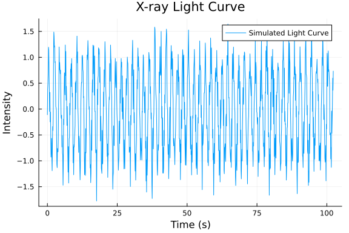

```@meta
CurrentModule = Stingray
```

# Welcome to Stingray.jl

Documentation for [Stingray.jl](https://github.com/StingraySoftware/Stingray.jl).

```@index
```

## Overview
**Stingray.jl** is a Julia package for **X-ray spectral timing analysis**, designed for high-performance astrophysical data processing.

### Features:
- **Fast Fourier Transforms (FFT)** for analyzing periodic signals.
- **Periodograms** to measure signal variability.
- **Cross-spectra and coherence analysis** for multi-band signals.
- **Optimized for performance** with Julia’s native speed advantages.


## Quick Example
Here's a simple example to analyze an X-ray light curve:

```@julia
using Stingray, Random, Plots
N = 1024
t = collect(0:0.1:(N-1)*0.1)
Random.seed!(42)
light_curve = sin.(2π * 0.5 .* t) + 0.3 * randn(N)  # Sine wave + noise
plot(t, light_curve, label="Simulated Light Curve", xlabel="Time (s)", ylabel="Intensity", title="X-ray Light Curve", legend=:topright)
```
This code generates a simulated X-ray light curve with a sine wave and Gaussian noise, then plots it


