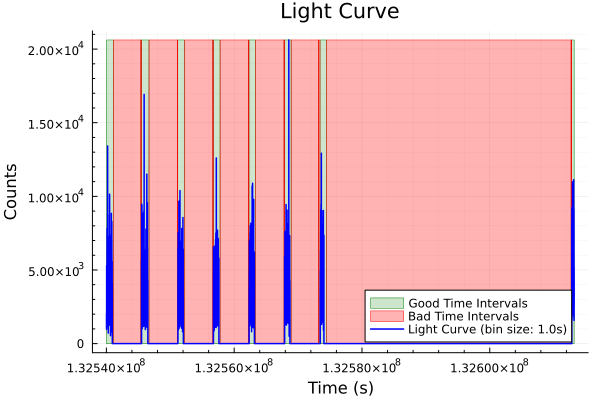
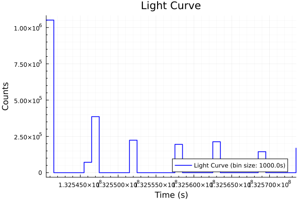
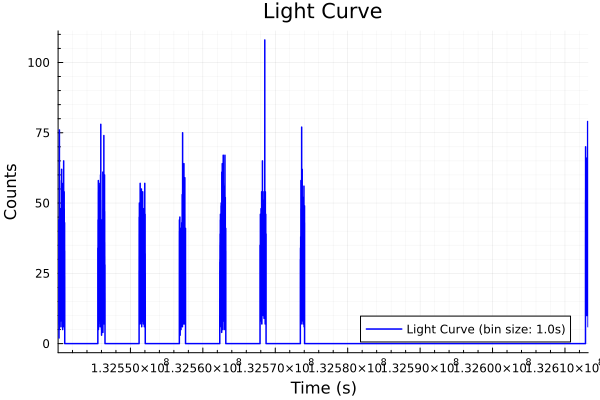
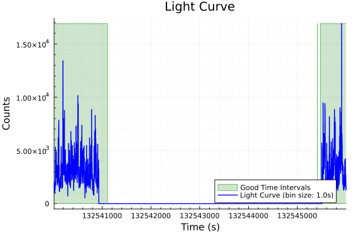
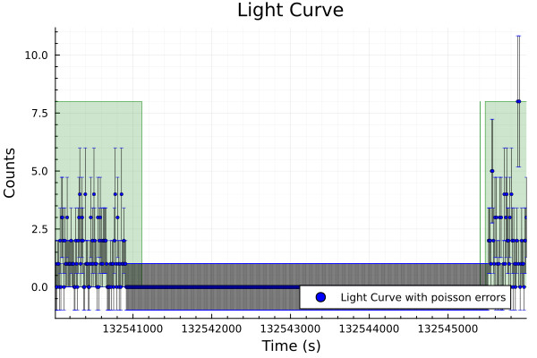
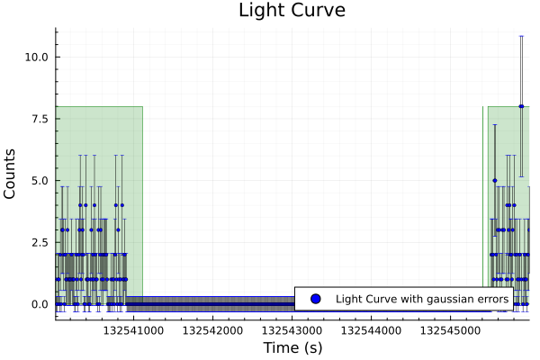
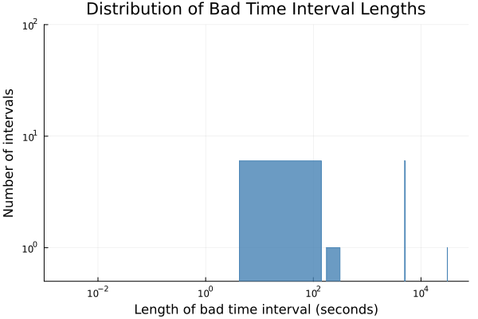
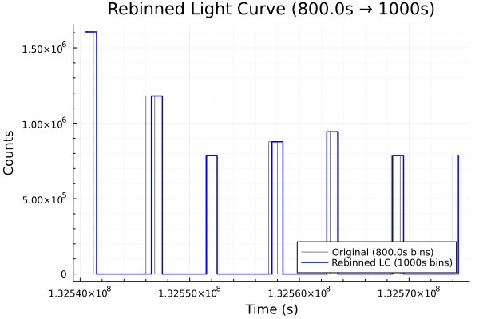
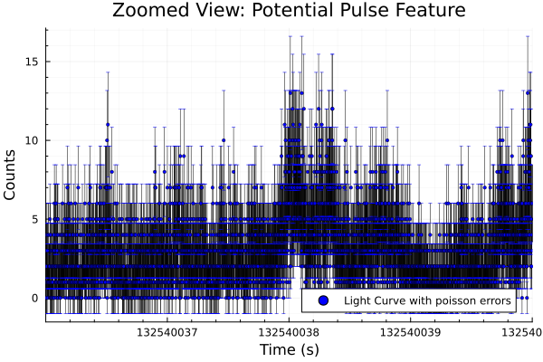
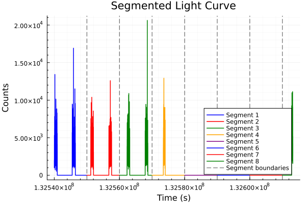

# LightCurve Analysis

## Overview

A **light curve** is a binned time series showing how the brightness (count rate) of an astronomical source changes over time. This guide covers everything you need to know about creating and analyzing light curves from NICER X-ray data.

### What You'll Learn
- How to convert event lists to light curves
- Different binning strategies and their uses
- Error calculation methods (Poisson vs Gaussian)
- Time series analysis techniques
- Handling Good Time Intervals (GTI)
- Rebinning operations for different time scales

### Let's start understanding the lightcurve via this [simulation](https://astro.unl.edu/classaction/animations/binaryvariablestars/lightcurve.html)
- reference [docs](https://imagine.gsfc.nasa.gov/science/toolbox/timing1.html)
- reference [discussion for plots](https://github.com/StingraySoftware/Stingray.jl/pull/60#issue-3307865719)
## Core Data Structures

### LightCurve Structure

```julia
struct LightCurve{T}
    time::Vector{T}              # Time bin centers
    dt::Union{T,Vector{T}}       # Bin size(s)
    counts::Vector{Int}          # Photon counts per bin
    count_error::Vector{T}       # Statistical uncertainties
    exposure::Vector{T}          # Exposure time per bin
    properties::Vector{EventProperty}  # Additional computed properties
    metadata::LightCurveMetadata       # Observational metadata
    err_method::Symbol           # :poisson or :gaussian
end
```

### Supporting Structures

#### EventProperty
Stores additional computed properties for each time bin:
```julia
struct EventProperty{T}
    name::Symbol        # Property identifier (:mean_energy, :hardness, etc.)
    values::Vector{T}   # Property values for each bin
    unit::String        # Physical units ("keV", "counts/s", etc.)
end
```

#### LightCurveMetadata
Comprehensive metadata about the observation:
```julia
struct LightCurveMetadata
    telescope::String           # "NICER"
    instrument::String         # "XTI"
    object::String            # Source name
    mjdref::Float64           # Time reference
    time_range::Tuple{Float64,Float64}  # Start/stop times
    bin_size::Float64         # Bin size in seconds
    headers::Vector{Dict}     # Original FITS headers
    extra::Dict{String,Any}   # Processing metadata
end
```

## Creating Light Curves

### Basic Light Curve Creation

The primary function for creating light curves is `create_lightcurve`:


```julia
# Load NICER event data
events = readevents("ni1200120104_0mpu7_cl.evt", mission="nicer", sort=true)

# Create basic 1-second binned light curve
lc = create_lightcurve(events, 1.0)

println("Created light curve with $(length(lc)) bins")
println("Time range: $(lc.metadata.time_range)")
println("Total counts: $(sum(lc.counts))")
```

    Created light curve with 73195 bins
    Time range: (1.3254001300020403e8, 1.3261320799981469e8)
    Total counts: 21244574
    


```julia
# Check if GTIs are present
if has_gti(events)
    println("GTIs found: ", size(gti(events)))
    println("GTI time ranges: ", gti(events))
else
    println("No GTIs found in EventList")
end
```

    GTIs found: (16, 2)
    GTI time ranges: [1.3253976495089497e8 1.3253976576176885e8; 1.3253982646126564e8 1.325411107616295e8; 1.325454089357243e8 1.3254541076280095e8; 1.3254547176242965e8 1.3254667076160833e8; 1.3255111289646628e8 1.3255111376230884e8; 1.3255117446225293e8 1.325522337618084e8; 1.3255667191721778e8 1.3255667276215422e8; 1.3255673446167018e8 1.3255779376177037e8; 1.3256225189370081e8 1.3256225276146586e8; 1.3256231576145831e8 1.3256335376253688e8; 1.3256781089506708e8 1.32567811761988e8; 1.325678744612888e8 1.325689137617901e8; 1.3257318994343342e8 1.325731907617313e8; 1.3257343446093558e8 1.3257447376209004e8; 1.3261273271212834e8 1.3261273376168376e8; 1.3261281476161912e8 1.3261337376368217e8]
    

#### for gti/bti loading u must use `gtis_data = gti(events)` prefer below example


```julia
using Plots
gtis_data = gti(events)
plot(lc, show_btis=true,show_gti=true ,gtis=gtis_data)
```



### Function Signature and Parameters for create_lightcurve

```julia
function create_lightcurve(
    eventlist::EventList,
    binsize::Real;
    err_method::Symbol = :poisson,
    tstart::Union{Nothing,Real} = nothing,
    tstop::Union{Nothing,Real} = nothing,
    energy_filter::Union{Nothing,Tuple{Real,Real}} = nothing
) -> LightCurve
```

**Parameters:**
- `eventlist`: Your NICER EventList data
- `binsize`: Time bin size in seconds
- `err_method`: Error calculation method (`:poisson` or `:gaussian`)
- `tstart/tstop`: Optional time range filters
- `energy_filter`: Optional energy band selection `(emin, emax)`

### Choosing Bin Sizes

The bin size determines your time resolution and statistical accuracy:


```julia
# High time resolution (good for fast variability)
fast_lc = create_lightcurve(events, 0.01)  # 10 ms bins
println("Fast LC: $(length(fast_lc)) bins, avg counts/bin: $(mean(fast_lc.counts))")

# Moderate resolution (balanced approach)  
medium_lc = create_lightcurve(events, 1.0)  # 1 second bins
println("Medium LC: $(length(medium_lc)) bins, avg counts/bin: $(mean(medium_lc.counts))")

# Low resolution (good statistics per bin)
slow_lc = create_lightcurve(events, 1000.0)  # 1000 second bins  
println("Slow LC: $(length(slow_lc)) bins, avg counts/bin: $(mean(slow_lc.counts))")
```

    Fast LC: 7319500 bins, avg counts/bin: 2.902462463283011
    Medium LC: 73195 bins, avg counts/bin: 290.24624632830114
    Slow LC: 34 bins, avg counts/bin: 72168.20588235294
    

### For plotting u can diretlly use plot or u can use `plot(lc,1000)`


```julia
plot(slow_lc)
```

/

**Choosing the Right Bin Size:**
- **Fast variability (ms-scale)**: Use 0.001 - 0.1 seconds
- **Typical timing analysis**: Use 0.1 - 1 seconds  
- **Long-term trends**: Use 10 - 100 seconds
- **Rule of thumb**: Aim for 10-100 counts per bin for good statistics

### Energy Band Selection

NICER operates in the 0.2-12 keV range. Select energy bands for specific science:


```julia
# Full NICER band
full_lc = create_lightcurve(events, 1.0, energy_filter=(0.2, 12.0))

# Soft X-ray band (thermal emission)
soft_lc = create_lightcurve(events, 1.0, energy_filter=(0.2, 2.0))

# Hard X-ray band (non-thermal emission)  
hard_lc = create_lightcurve(events, 1.0, energy_filter=(2.0, 12.0))

# Custom band (e.g., around iron K-alpha line)
iron_lc = create_lightcurve(events, 1.0, energy_filter=(6.0, 7.0))

println("Full band: $(sum(full_lc.counts)) total counts")
println("Soft band: $(sum(soft_lc.counts)) total counts") 
println("Hard band: $(sum(hard_lc.counts)) total counts")
```

    Full band: 21242782 total counts
    Soft band: 17208686 total counts
    Hard band: 4034096 total counts
    

#### Ploting while u may directly use `plot(events, energy_filter=(0,5e3))`


```julia
plot(iron_lc)
```

/

### Time Range Selection

Focus on specific portions of your observation:


```julia
# Get the observation time range
t_start = minimum(times(events))
t_end = maximum(times(events))
duration = t_end - t_start


# First hour of observation
early_lc = create_lightcurve(events, 1.0, 
    tstart=t_start, 
    tstop=t_start + 3600.0)

# Peak activity period (if you know when it occurred)
peak_start = t_start + 5000.0  # 5000 seconds into observation
peak_lc = create_lightcurve(events, 0.1,  # Fine time resolution
    tstart=peak_start,
    tstop=peak_start + 600.0)  # 10-minute window

# Last 2 hours
late_lc = create_lightcurve(events, 1.0,
    tstart=t_end - 7200.0,
    tstop=t_end)
println("Observation duration: $(duration/3600) hours")
println("First hour of observation : $(length(early_lc))")
println("Peak activity period: $(length(peak_lc))")
println("Last 2 hours: $(length(late_lc))")
```

    Observation duration: 20.331944336295127 hours
    First hour of observation : 916
    Peak activity period: 1141
    Last 2 hours: 374
    

#### You can directly use in plots like this or use direct event file like: `plot(events, tstart=1.32540e8, tstop=1.32546e8)`


```julia
plot(lc, tstart=1.32540e8, tstop=1.32546e8,show_gti=true)
```




## Error Calculations

### Poisson Statistics (Default)

For X-ray photon counting, Poisson statistics are appropriate:
### For Poisson: σ = √N (where N = counts)


```julia
# Poisson errors (default)
lc_poisson = create_lightcurve(events, 1.0, err_method=:poisson)

# Examine the errors
#here i am slicing the datato avoid messy notebook[1:5]
println("Sample counts: ", lc_poisson.counts[1:5])
println("Poisson errors: ", lc_poisson.count_error[1:5])
println("Signal-to-noise: ", lc_poisson.counts[1:5] ./ lc_poisson.count_error[1:5])
# SNR = N/√N = √N
```

    Sample counts: [1541, 1508, 1974, 1600, 1337]
    Poisson errors: [39.25557285278104, 38.8329756778952, 44.429719783046124, 40.0, 36.565010597564445]
    Signal-to-noise: [39.25557285278104, 38.8329756778952, 44.429719783046124, 40.0, 36.56501059756444]
    

#### plotting poisson error you can directly use thia `plot(lc, show_errors=true)` here i am using via tstart and tstop for better analysis
##### important instruction please use a bin size above 10 ; otherwise it may be very stressful for your computer. we are working on this optimization to make it as much efficient as needed for larger datasets like nicer
- you can use `energy_filter=(6.99, 7.0)` in create light curve to get more detailed anlysis like that 


```julia
using Plots
lc = create_lightcurve(events, 10,energy_filter=(6.99, 7.0))
plot(lc,show_errors=true,tstart=1.32540e8, tstop=1.32546e8,show_gti=true)
```



### Custom Gaussian Errors

Sometimes you may have custom error estimates:

#### remember that `set_errors!` changes your data immediatly so, be carefull


```julia
# Create light curve without errors first
lc_g = create_lightcurve(events, 10,energy_filter=(6.99, 7.0))

# Set custom errors
custom_Gaussian_errors = sqrt.(lc.counts .+ 0.1)  # Modified Poisson
set_errors!(lc, custom_Gaussian_errors)

println("Custom errors applied: ", lc.err_method ," ,count_error: ",lc.count_error[1:2])#here i am slicing the datato avoid messy notebook[1:2]
plot(lc,show_errors=true,tstart=1.32540e8, tstop=1.32546e8,show_gti=true)
```

    Custom errors applied: gaussian ,count_error: [1.0488088481701516, 0.31622776601683794]
    



### Error Calculation Functions


```julia
using StatsBase: fit, Histogram
# Manual error calculation
counts_data = [10, 25, 5, 0, 15]
# don't use counts, it will give an error: 
#"cannot assign a value to imported variable StatsBase.counts from module Main"
# since Stingray is using these variables in many functions
# Poisson errors
poisson_errs = calculate_errors(counts_data, :poisson)
println("Poisson errors: ", poisson_errs)  # [3.16, 5.0, 2.24, 1.0, 3.87]

# Custom Gaussian errors
gaussian_errs = [0.5, 0.8, 0.3, 0.1, 0.6]
custom_errs = calculate_errors(counts_data, :gaussian, gaussian_errors=gaussian_errs)
println("Custom errors: ", custom_errs)

# Recalculate errors after modifying counts
set_errors!(lc)
# you may encounter this error : ArgumentError: Gaussian errors must be provided when using :gaussian method
# The error occurs because your light curve lc has err_method = :gaussian, 
# but when you call calculate_errors!(lc), 
# it tries to recalculate errors using the Gaussian method without providing the required gaussian_errors parameter.
lc.counts[1:5] .+= 10  # Add background
calculate_errors!(lc)   # Update using existing method
```

    Poisson errors: [3.1622776601683795, 5.0, 2.23606797749979, 1.0, 3.872983346207417]
    Custom errors: [0.5, 0.8, 0.3, 0.1, 0.6]
    


    7320-element Vector{Float64}:
     3.3166247903554
     3.1622776601683795
     3.1622776601683795
     3.3166247903554
     3.3166247903554
     1.0
     1.4142135623730951
     1.0
     1.7320508075688772
     1.7320508075688772
     1.4142135623730951
     1.0
     1.4142135623730951
     ⋮
     1.0
     2.0
     1.0
     1.0
     2.8284271247461903
     1.0
     1.0
     2.8284271247461903
     1.7320508075688772
     1.0
     2.0
     1.4142135623730951


## Time Binning Operations

### Understanding Time Bins


```julia
# Create time bins manually
start_time = 1000.0
stop_time = 1100.0  
binsize = 1.0

edges, centers = create_time_bins(start_time, stop_time, binsize)

println("Number of bins: ", length(centers))
println("Bin edges: ", edges[1:5])
println("Bin centers: ", centers[1:5])
println("Bin width: ", edges[2] - edges[1])
```

    Number of bins: 101
    Bin edges: [1000.0, 1001.0, 1002.0, 1003.0, 1004.0]
    Bin centers: [1000.5, 1001.5, 1002.5, 1003.5, 1004.5]
    Bin width: 1.0
    

**Key Concepts:**
- **Bin edges**: Define bin boundaries [t₁, t₂, t₃, ...]
- **Bin centers**: Middle of each bin, used for plotting
- **Binning rule**: Events in time range [tᵢ, tᵢ₊₁) go into bin i

### Event Binning Process


```julia
# Manual event binning example
event_times = [1.1, 1.3, 1.7, 2.2, 2.8, 3.1]
bin_edges = [1.0, 2.0, 3.0, 4.0]

counts_data1 = bin_events(event_times, bin_edges)
println("Events per bin: ", counts_data1)  # [3, 2, 1]

# The binning process:
# Bin 1 [1.0, 2.0): events at 1.1, 1.3, 1.7 → 3 counts
# Bin 2 [2.0, 3.0): events at 2.2, 2.8 → 2 counts  
# Bin 3 [3.0, 4.0]: event at 3.1 → 1 count (last bin is inclusive)
```

    Events per bin: [3, 2, 1]
    

## Advanced Features

### Event Properties

Light curves can store additional computed properties:


```julia
# Create light curve (automatically computes mean energy if available)
lc = create_lightcurve(events, 1.0, energy_filter=(0.2, 12.0))

# Check what properties were calculated
for prop in lc.properties
    println("Property: $(prop.name)")
    println("Units: $(prop.unit)")
    println("Sample values: ", prop.values[1:5])
end

# Access mean energy per bin
if !isempty(lc.properties)
    mean_energy = lc.properties[1].values  # Assuming first property is mean_energy
    
    # Plot mean energy evolution
    println("Mean energy range: $(extrema(mean_energy)) keV")
    
    # Find bins with high/low mean energy
    high_energy_bins = findall(x -> x > 2.0, mean_energy)
    println("High energy bins: $(length(high_energy_bins))")
end
```

    Property: mean_energy
    Units: keV
    Sample values: [1.663549643088905, 1.533852785145892, 1.5310891590678828, 1.520256410256408, 1.5692370979805568]
    Mean energy range: (0.0, 1.8253566433566448) keV
    High energy bins: 0
    

### GTI Handling in Light Curves

Good Time Intervals are automatically preserved in light curve metadata:


```julia
# Create light curve from events with GTI
events = readevents("ni1200120104_0mpu7_cl.evt", 
    mission="nicer", 
    load_gti=true, 
    sort=true)

lc = create_lightcurve(events, 1.0)

# Check GTI information in metadata
if haskey(lc.metadata.extra, "gti") && !isnothing(lc.metadata.extra["gti"])
    gti_matrix = lc.metadata.extra["gti"]
    println("GTI intervals in light curve: $(size(gti_matrix, 1))")
    
    # Use different variable names to avoid conflicts
    gti_exposure_time = sum(diff(gti_matrix; dims=2))  
    total_observation_time = lc.metadata.time_range[2] - lc.metadata.time_range[1] 
    observation_efficiency = gti_exposure_time / total_observation_time  
    
    println("GTI efficiency: $(observation_efficiency*100)%")
end
```

    GTI intervals in light curve: 16
    GTI efficiency: 11.319701220659008%
    

### we have BTI(~GTI) analysis sepratly in our plotting methods :
refer to this [discussion](https://github.com/StingraySoftware/Stingray.jl/pull/60#issuecomment-3172831898)


```julia
bti=BTIAnalysisPlot(events)
plot(bti,bti_analysis=true)
```

    Total exposure: 8285.455264389515
    Total BTI length: 65262.6580260247
    Total BTI length (short BTIs): 0.0
    total 16 gti segments
    



### Rebinning Operations

Change time resolution while preserving total counts:


```julia
# Start with high-resolution light curve
fine_lc = create_lightcurve(events, 0.1)  # 100 ms bins
println("Fine LC: $(length(fine_lc)) bins")

# Rebin to coarser resolution
coarse_lc = rebin(fine_lc, 1.0)  # 1 second bins
println("Coarse LC: $(length(coarse_lc)) bins")

# Check count conservation
println("Fine total counts: $(sum(fine_lc.counts))")
println("Coarse total counts: $(sum(coarse_lc.counts))")
println("Counts conserved: $(sum(fine_lc.counts) == sum(coarse_lc.counts))")

# Rebinning preserves metadata
println("Original bin size: $(fine_lc.metadata.bin_size)")
println("Rebinned bin size: $(coarse_lc.metadata.bin_size)")
println("Original bin size stored: $(coarse_lc.metadata.extra["original_binsize"])")
```

    Fine LC: 731950 bins
    Coarse LC: 73195 bins
    Fine total counts: 21244574
    Coarse total counts: 21244574
    Counts conserved: true
    Original bin size: 0.1
    Rebinned bin size: 1.0
    Original bin size stored: 0.1
    

**What `rebin` Does Step-by-Step:**

The rebinning process combines adjacent time bins while preserving all physical quantities:

1. **Validation**: Ensures new bin size is larger than current bin size
   - You can only rebin to coarser resolution (not finer)
   - This prevents creating artificial data points

2. **New Time Grid**: Creates a new set of bin edges with the larger bin size
   - Uses the same time range as the original light curve
   - Maintains proper alignment with bin boundaries

3. **Count Redistribution**: 
   - For each bin in the original light curve, determines which new bin it belongs to
   - Adds the counts from original bins into the appropriate new bin
   - This is why total counts are exactly preserved

4. **Property Handling**: For additional properties (like mean energy):
   - Calculates weighted averages based on the counts in each bin
   - Formula: `new_property = Σ(old_property × old_counts) / Σ(old_counts)`
   - This preserves the physical meaning of derived quantities

5. **Error Recalculation**: 
   - Recalculates errors for the new bin counts using the existing error method
   - For Poisson: new_error = √(new_counts)
   - For Gaussian: combines errors appropriately

6. **Metadata Update**: 
   - Updates bin size in metadata
   - Preserves original bin size in `extra` field for traceability
   - Keeps all other metadata unchanged

**Why Rebinning is Useful:**
- **Increase statistics**: Higher counts per bin → better signal-to-noise ratio
- **Match phenomena timescales**: Use appropriate resolution for the physics
- **Computational efficiency**: Fewer data points for analysis
- **Comparison studies**: Match resolution between different observations

**Mathematical Properties Preserved:**
- **Total counts**: Σ(old_counts) = Σ(new_counts) exactly
- **Total exposure time**: Time-weighted averages are correct
- **Mean properties**: Weighted by actual photon counts in each bin

**When to Rebin:**
- **Increase statistics**: Combine bins for better signal-to-noise
- **Match time scales**: Adapt resolution to phenomena of interest
- **Computational efficiency**: Reduce data size for analysis
- **Comparison studies**: Match resolution between observations

## plotting methods of 
- rebin
Whenever you write bin in a plot like `plot(lc,100)`after defining `lc = create_lightcurve(events, 1.0)` before will automatically draw a plot
there are some conventions like:
- original_alpha=1
- show_original=true


```julia
lc = create_lightcurve(events, 800)
plot(lc, 1000, show_original=true, original_alpha=1)
```



## Practical Examples

### Example 1: Pulsar Timing Analysis


```julia
# Load NICER data of a pulsar
pulsar_events = readevents("ni1200120104_0mpu7_cl.evt", mission="nicer", sort=true)

# Create high-resolution light curve for pulse profile
pulse_lc = create_lightcurve(pulsar_events, 0.001,  # 1 ms resolution
    energy_filter=(0.2, 12.0))

println("Pulse LC: $(length(pulse_lc)) bins over $(pulse_lc.metadata.time_range)")
println("Mean count rate: $(mean(pulse_lc.counts ./ pulse_lc.exposure)) counts/s")

# Check for pulsations
max_counts = maximum(pulse_lc.counts)
min_counts = minimum(pulse_lc.counts)
pulsed_fraction = (max_counts - min_counts) / (max_counts + min_counts)
println("Pulsed fraction: $(pulsed_fraction*100)%")
```

    Pulse LC: 73195000 bins over (1.3254001300020403e8, 1.3261320799981469e8)
    Mean count rate: 290.2217637816791 counts/s
    Pulsed fraction: 100.0%
    

#### ZOOMING INTO SPECIFIC PULSES


```julia
# If you know roughly where pulses occur, zoom into those regions
# For example, if you found a strong pulse around a specific time:
interesting_time = minimum(pulse_lc.time) + 25.0  # Example time
zoom_window = 2.0  # Look at ±1 second around the pulse

plot(pulse_lc,
     tstart=interesting_time - zoom_window,
     tstop=interesting_time + zoom_window,
     show_errors=true,
     title="Zoomed View: Potential Pulse Feature")
```



### Example 2: Burst Detection


```julia
# Create light curve optimized for burst detection
burst_lc = create_lightcurve(events, 0.1,  # 100 ms resolution
    energy_filter=(0.2, 12.0))

# Calculate rolling background
window_size = 100  # bins
background_rate = zeros(length(burst_lc))

for i in 1:length(burst_lc)
    start_idx = max(1, i - window_size ÷ 2)
    end_idx = min(length(burst_lc), i + window_size ÷ 2)
    background_rate[i] = mean(burst_lc.counts[start_idx:end_idx])
end

# Identify potential bursts (>5σ above background)
sigma_threshold = 5.0
burst_candidates = []

for i in 1:length(burst_lc)
    expected_bg = background_rate[i]
    observed = burst_lc.counts[i]
    significance = (observed - expected_bg) / sqrt(expected_bg)
    
    if significance > sigma_threshold
        push!(burst_candidates, (i, burst_lc.time[i], significance))
    end
end

println("Found $(length(burst_candidates)) potential bursts")
for (idx, time, sig) in burst_candidates[1:min(5, end)]
    println("Burst at bin $idx, time $(time), significance $(sig)σ")
end
```

    Found 12312 potential bursts
    Burst at bin 7, time 1.3254001365e8, significance 8.109005333027902σ
    Burst at bin 23, time 1.3254001525e8, significance 11.584423170455024σ
    Burst at bin 26, time 1.3254001555e8, significance 7.976949868254941σ
    Burst at bin 65, time 1.3254001945e8, significance 6.649521370163141σ
    Burst at bin 66, time 1.3254001955e8, significance 13.689210946249203σ
    

### Example 3: Multi-Energy Band Analysis


```julia
# Define energy bands for spectral timing
energy_bands = [
    ("soft", (0.2, 1.0)),
    ("medium", (1.0, 3.0)), 
    ("hard", (3.0, 12.0))
]

# Create light curves for each band
band_lightcurves = Dict()
binsize = 1.0

for (name, (emin, emax)) in energy_bands
    lc = create_lightcurve(events, binsize, energy_filter=(emin, emax))
    band_lightcurves[name] = lc
    
    total_counts = sum(lc.counts)
    mean_rate = mean(lc.counts ./ lc.exposure)
    
    println("$name band ($emin-$emax keV): $total_counts counts, $(mean_rate) counts/s")
end

# Calculate hardness ratio
soft_lc = band_lightcurves["soft"]
hard_lc = band_lightcurves["hard"]

# Ensure same time binning
@assert length(soft_lc) == length(hard_lc) "Light curves must have same binning"

# Calculate hardness ratio: (H-S)/(H+S)
hardness_ratio = (hard_lc.counts .- soft_lc.counts) ./ (hard_lc.counts .+ soft_lc.counts)

# Handle division by zero
hardness_ratio[isnan.(hardness_ratio)] .= 0.0

println("Hardness ratio range: $(extrema(hardness_ratio))")
println("Mean hardness: $(mean(hardness_ratio))")
```

    soft band (0.2-1.0 keV): 9446587 counts, 129.0605505840563 counts/s
    medium band (1.0-3.0 keV): 9795094 counts, 133.821900403033 counts/s
    hard band (3.0-12.0 keV): 2001101 counts, 27.339312794589794 counts/s
    Hardness ratio range: (-0.778819851504494, 0.0)
    Mean hardness: -0.05431549587942111
    

### Example 4: Long-term Variability Study


```julia
# Create light curve for long-term trends
longterm_lc = create_lightcurve(events, 60.0)  # 1-minute bins

# Calculate count rate and uncertainties
count_rates = longterm_lc.counts ./ longterm_lc.exposure
count_rate_errors = longterm_lc.count_error ./ longterm_lc.exposure

println("Long-term light curve: $(length(longterm_lc)) bins")
println("Count rate range: $(extrema(count_rates)) counts/s")

# Identify significant variability
mean_rate = mean(count_rates)
variability_threshold = 2.0  # 2σ

variable_bins = findall(x -> abs(x - mean_rate) > variability_threshold * mean(count_rate_errors), 
                       count_rates)

println("Variable bins (>2σ): $(length(variable_bins))")
println("Variability fraction: $(length(variable_bins)/length(longterm_lc)*100)%")

# Calculate fractional RMS variability
excess_variance = var(count_rates) - mean(count_rate_errors.^2)
fractional_rms = sqrt(max(0, excess_variance)) / mean_rate

println("Fractional RMS variability: $(fractional_rms*100)%")
```

    Long-term light curve: 1221 bins
    Count rate range: (0.0, 5621.766666666666) counts/s
    Variable bins (>2σ): 1221
    Variability fraction: 100.0%
    Fractional RMS variability: 332.48443699152284%
    

## Array Interface

Light curves behave like arrays for convenient access:


```julia
lc = create_lightcurve(events, 1.0)

# Array-like operations
println("Length: ", length(lc))
println("Size: ", size(lc))

# Access individual bins (returns time, counts tuple)
first_bin = lc[1]
println("First bin: time=$(first_bin[1]), counts=$(first_bin[2])")

# Access ranges
first_ten = lc[1:10]
println("First 10 bins: ", length(first_ten))

# Iteration
bright_bins = 0
for (time, counts) in lc
    if counts > 100
        bright_bins += 1
    end
end
println("Bins with >100 counts: $bright_bins")
```

    Length: 73195
    Size: (73195,)
    First bin: time=1.325400135e8, counts=1541
    First 10 bins: 10
    Bins with >100 counts: 6235
    

## plotting methods of 
- segmentation
```julia
create_segments(events::EventList, segment_duration::Real; bin_size::Real = 1.0)
```
we have one inbuilt function for segmentations


```julia
segments = create_segments(events, 10000.0)
plot(segments, 
     show_errors=false,
     show_segment_boundaries=true,
     segment_colors=[:blue, :red, :green, :orange, :purple])
```

    Data time range: 1.3254001300020403e8 to 1.3261320799981469e8 (73194.99961066246 seconds total)
    Creating 8 segments of 10000.0 seconds each
    Segment 1: 6113252 events from 1.3254001300020403e8 to 1.3255001300020403e8
    Segment 2: 5364219 events from 1.3255001300020403e8 to 1.3256001300020403e8
    Segment 3: 5819875 events from 1.3256001300020403e8 to 1.3257001300020403e8
    Segment 4: 2247589 events from 1.3257001300020403e8 to 1.3258001300020403e8
    Segment 5: 0 events from 1.3258001300020403e8 to 1.3259001300020403e8
    Segment 6: 0 events from 1.3259001300020403e8 to 1.3260001300020403e8
    Segment 7: 0 events from 1.3260001300020403e8 to 1.3261001300020403e8
    Segment 8: 1699639 events from 1.3261001300020403e8 to 1.3261320799981469e8
    total 8 segments
    



## Troubleshooting

### Common Issues

#### 1. "Event list is empty"
```julia
# Check your event list before creating light curve
if isempty(times(events))
    println("No events in EventList - check your filters")
else
    lc = create_lightcurve(events, 1.0)
end
```

#### 2. "No events remain after filtering"
```julia
# Check your filter parameters
events = readevents("data.evt", mission="nicer", sort=true)
println("Total events: ", length(events))

if has_energies(events)
    e_range = extrema(energies(events))
    println("Energy range: $e_range keV")
end

t_range = extrema(times(events))
println("Time range: $t_range")

# Use realistic filters
try
    lc = create_lightcurve(events, 1.0, 
        energy_filter=(0.2, 12.0),  # NICER energy range
        tstart=t_range[1] + 100.0,  # Skip first 100 seconds
        tstop=t_range[2] - 100.0)   # Skip last 100 seconds
catch e
    println("Filter error: $e")
end
```

#### 3. Poor Statistics (Too Many Zero Bins)
```julia
lc = create_lightcurve(events, 0.001)  # Very fine binning

zero_bins = count(x -> x == 0, lc.counts)
zero_fraction = zero_bins / length(lc)

println("Zero bins: $(zero_bins)/$(length(lc)) ($(zero_fraction*100)%)")

if zero_fraction > 0.5
    println("Too many zero bins - consider larger bin size")
    better_lc = rebin(lc, 0.01)  # Rebin to 10ms
    new_zero_fraction = count(x -> x == 0, better_lc.counts) / length(better_lc)
    println("After rebinning: $(new_zero_fraction*100)% zero bins")
end
```

### Best Practices

1. **Choose appropriate bin sizes**: Balance time resolution with statistics
2. **Validate your data**: Check event counts and time ranges before processing
3. **Preserve original data**: Use non-destructive operations when possible
4. **Document your analysis**: Light curve metadata preserves processing history
5. **Handle GTI properly**: Check GTI efficiency and gaps in your observations

### Performance Tips

```julia
# For large datasets, use appropriate bin sizes
n_events = length(events)
println("Dataset size: $n_events events")

if n_events > 1_000_000
    println("Large dataset - using coarser binning")
    lc = create_lightcurve(events, 1.0)  # 1-second bins
else
    println("Moderate dataset - fine binning OK")
    lc = create_lightcurve(events, 0.1)  # 100ms bins
end

# Memory usage estimate
bins = length(lc)
memory_mb = bins * (8 + 4 + 8 + 8) / 1024^2  # Rough estimate
println("Light curve memory usage: ~$(memory_mb) MB")
```

### Thank you
